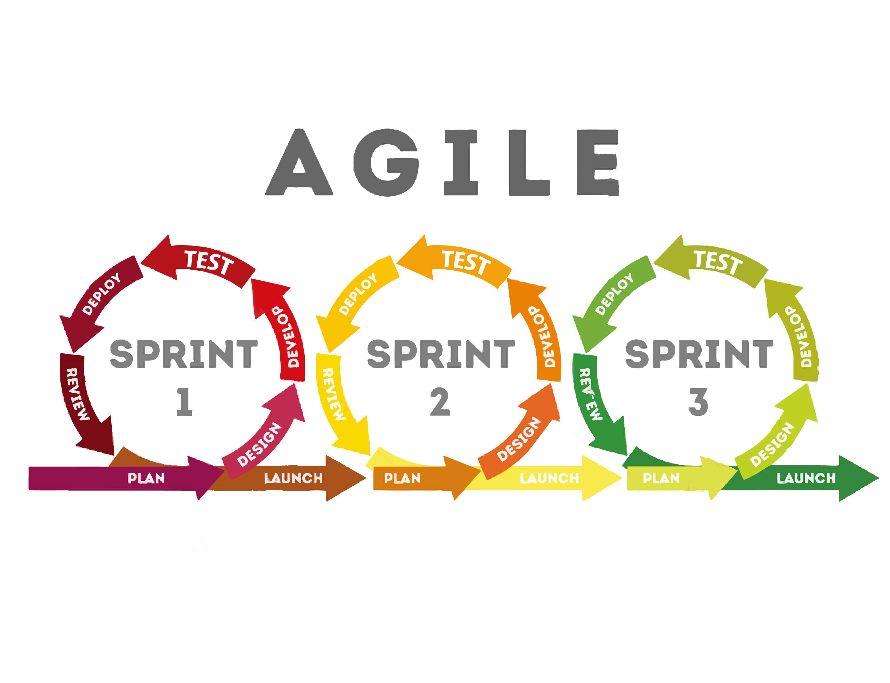

# Agile Methodology (애자일 방법론)

> **프로젝트 관리 및 개발에 대한 반복적인 접근 방식**

    큰 한 번의 roll back 보다는 작업을 작은 단위로 나눠 각 단위마다 변화에 유연하고 효과적으로 대응할 수 있다.

## 애자일의 가치

1. 공정과 도구보다 **개인과 상호작용**
2. 포괄적인 문서보다 **작동하는 소프트웨어**
3. 계약과 협상보다 **고객과의 협력**
4. 계획을 따르기보다 **변화에 대응하기**

## Scrum
> 애자일의 가장 대표적인 개발방법론으로 30일마다 동작 가능한 제품을 만들어내는 짧은 단위인 스프린트(sprint)로 나누어서 개발한다.

### Sprint
> 보통 1~4주의 기간을 상황과 조직에 맞게 선정한다. 잦은 시행착오를 통해 지속적으로 개선함으로 목표에 가장 잘 부합하는 결과물을 만들 수 있다.

### 한 마디로
    동작 가능한 프로토타입별 기간을 짧은 단위인 스프린트로 계획 후 중요 순서 순으로 반복 실행 & 요구조건의 변화에 즉각 반영하며 끊임없이 프로토타입을 개선해 나가는 방식
### ❗️warning❗️  
많은 사람들이 애자일과 스크럼을 같은 것이라고 생각하지만, 애자일은 일련의 원칙이고 스크럼은 작업을 완료하기 위한 프레임워크다.

## 반대격인 폭포수 방법론

