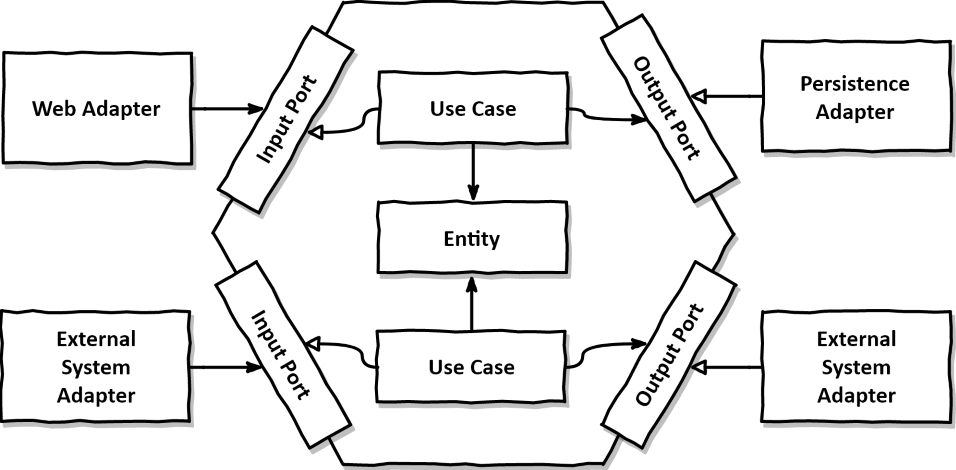
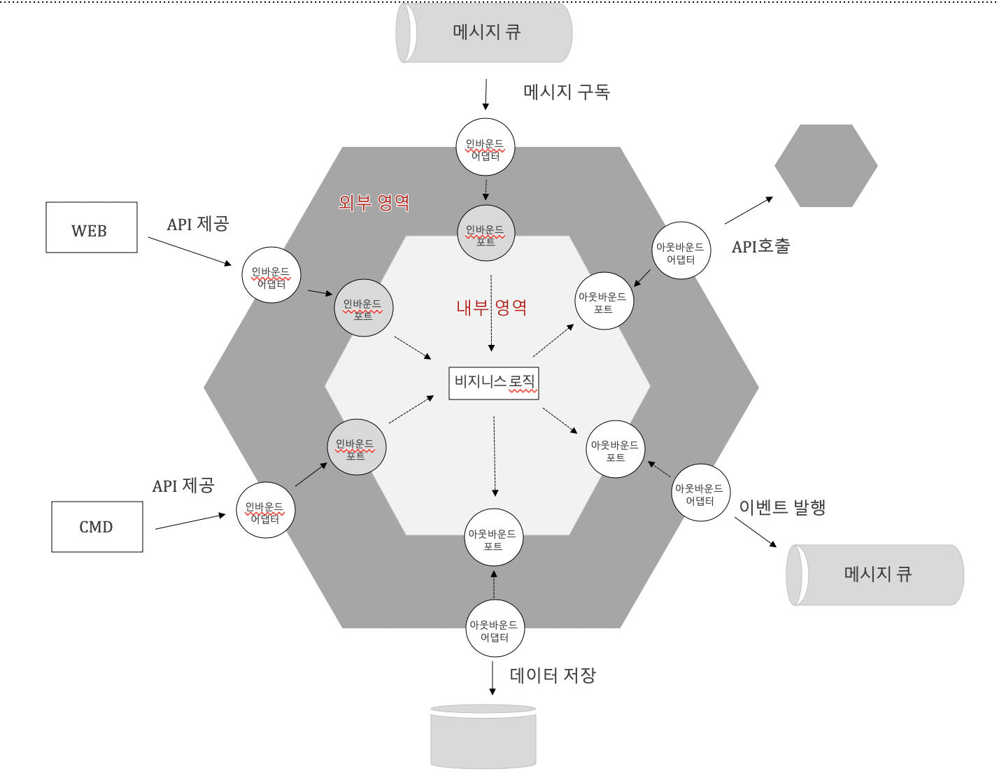

# Why Should We Use Hexagonal Architecture?

#### Hexagonal Architecture과 Ports and Adapters Architecture는 같다!

### 특징
- 고수준의 내부 영역이 어댑터에 전혀 의존 ❌
  - 이것을 가능케 하는것이 port!!

### 핵사고날이 해결하는 것
- Layered Architecture의 DIP 적용의 한계
- 현대의 어플리케이션은 보통 저수준이라고 이야기하는 data accessa layer, persentation layer 이외의 다양한 interface가 필요

### 내부 영역
- 고수준
- 기술에 독립적인 순수한 비즈니스 로직
- ports: 외부 영역과 연계되는 포트가 있음

### 그렇다면 port란

- #### Inbound Port
  - 내부 영역 사용을 위해 표출된 API
  - 외부 영역의 Inbound Adaptor가 호출함
- #### Outbound Port
  - 내부 영역이 외부를 호출하는 방법 정의
  - DIP 원칙처럼 Outbound Port가 외부의 Outbound Adaptor를 호출하여 외부 시스템과 연계하는게 아니라 Adaptor가  Port에 의존함

### 외부 영역
- 저수준
- interface 처리 담당
- Inbound Adaptors: 외부에서 들어오는 요청 처리
- Outbound Adapdors: 비즈니스 로직에 의해 호출되어 외부와 연계

- #### 외부 영역의 Adaptor
  - Inbound Adaptor
    - REST API 의 Controller
    - 웹 페이지를 구성하는 스프링 MVC Controller
    - 커맨드 핸들러
    - 이벤트 메시지 구독 핸들러

  - Outbound Adaptor
    - Data Aeccess 처리하는 DAO
    - 이벤트 메세지를 발행하는 클레스
    - 외부 서비스를 호출하는 프록시

