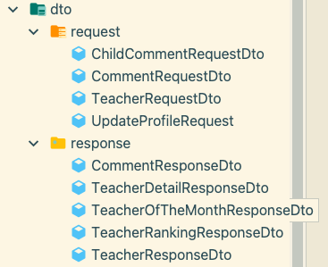
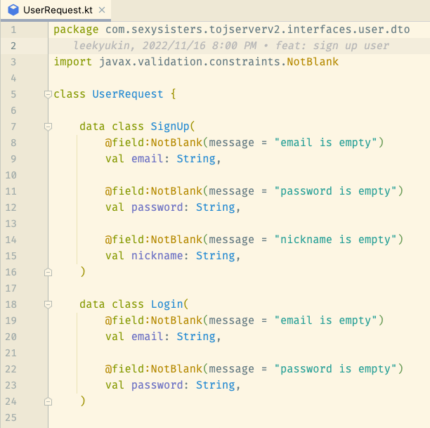

# DTO를 inner class로 관리하기

유저를 생성하는 create 기능을 만든다고 가정해보자
한 기능에 벌써 두개의 UserCreateRequest, UserCreateResponse DTO가 필요해진다.
아래처럼 UserXxxRequest 이런 식으로 DTO를 정의한다면 선별하고 구분하는데 불필요한 많은 인적 리소스가 소모된다.

아래와 같이 inner class로 관리하면 간편하다.
(여러 도메인드링 합쳐서 만들어지는 DTO는 inner class로 묶지 않는다.)
FYI, 아래는 Kotlin 코드다. 자바 개발자라면 그냥 한 클레스에 dto 클레스 뭉쳐놨구나 정도로만 봐주면 된다.

## 장점
> 응집도를 높인다
- 개발자 입장에서 inner class DTO는 해당 클레스 내에서 한정적으로 사용한다는 의미를 부여할 수 있어, 응집력이 높아지고 개발자들이 신경써야하는 외부 클래스의 개수가 줄어들어 개발 편의성을 향상 가능하다.